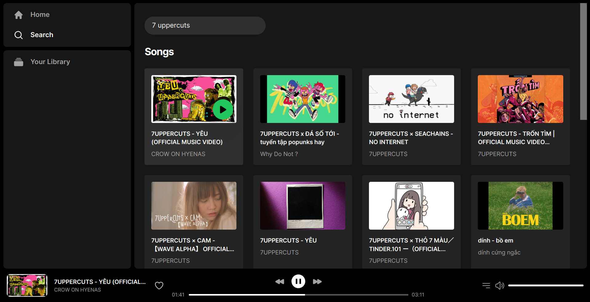

# Muer
Muer is a modern, open source music player, based on Invidious. It has:
- Better UI/UX
- No ads
- Better playlist management
- Default fallback using Youtube embedded player
- Federated design (people host their own instance of Muer)



# Development
Want to code immediately? Click this button

[](https://github.com/codespaces/new/muer-org/muer?quickstart=1)

This button will start (or resume) a Github Codespaces for this repo, with packages installed. You can then follow step 2 - 3 as below.

### Run local dev server on your own machine
1. Clone & Install all dependencies

  ```sh
  git clone https://github.com/muer-org/muer
  cd muer
  npm install
  ```

2. Copy [`.env.sample`](./.env.sample) file to `.env`. 
  - The file contains environment variables of the default staging database (owned by Tri). For now there is no functionality required `SUPABASE_SERVICE_KEY` so you can use the file as is, this probably will change in the future. Then, you would need create a Supabase database and replace the content with your own Supabase and session environment variables.

3. You can either start the Remix dev server (recommended) or the Netlify dev server
  - The Remix dev server starts your app in development mode, rebuilding assets on file changes. To start the Remix dev server:
    ```sh
    npm run dev
    ```

  - The Netlify CLI builds a production version of your Remix App Server and splits it into Netlify Functions that run locally. This includes any custom Netlify functions you've developed. The Netlify CLI runs all of this in its development mode. To start Netlify dev server:
    ```sh
    netlify dev
    ```
    - With Netlify Dev you can also:

      - test functions
      - test redirects
      - share a live session via url with `netlify dev --live`
      - [and more](https://cli.netlify.com/netlify-dev/)


    Note: When running the Netlify CLI, file changes will rebuild assets, but you will not see the changes to the page you are on unless you do a browser refresh of the page. Due to how the Netlify CLI builds the Remix App Server, it does not support hot module reloading.  

# Deployment
Quickest way is to deploy to Netlify. Want to deploy immediately? Click this button.

[](https://app.netlify.com/start/deploy?repository=https://github.com/muer-org/muer)

Clicking this button will start the setup for a new project and deployment.

## Deploy from the Command Line

Clone this repo with the `git clone` command. Then install the [Netlify CLI](https://docs.netlify.com/cli/get-started/) tool and run `netlify init`.

```sh
git clone https://github.com/muer-org/muer
cd muer
npm install netlify-cli -g # to install the Netlify CLI tool globally
netlify init # initialize a new Netlify project & deploy
```

## CI/CD

Using the 'Deploy to Netlify' button or the `init` process will also set up continuous deployment for your project so that a new build will be triggered & deployed when you push code to the repo (you can change this from your project dashboard: Site Settings/Build & deploy/Continuous Deployment).


## Host on your own platform & alternative PaaS

By hosting Muer on various platforms, you help ensure the future of this project. While we use Netlify by default due to its simplicity and speed, we highly encourage individuals to explore and document their experiences with running Muer on alternative platforms.

To run production server on your own platform using Netlify Dev

```
npm run start
```

Or using Remix App Server
```
cp remix.config.remixappserver.js remix.config.js
npm run build
npm run start-remixappserver
```

Here are some pointers to start using other PaaS(es):
- https://remix.run/docs/en/main/file-conventions/remix-config#serverbuildtarget
- https://vercel.com/guides/migrate-to-vercel-from-netlify
- https://developers.cloudflare.com/pages/migrations/migrating-from-netlify/
- https://github.com/dokku/dokku
- https://github.com/coollabsio/coolify

# Technical details
## Database

This project uses [Supabase](https://supabase.com/) for data storage and user authentication.
## Testing

### Cypress

We have set up the basic configuration files for [Cypress](https://go.cypress.io/) End-to-End tests in this project. You'll find those in the `cypress` directory. As you make changes, add to an existing file or create a new file in the `cypress/integrations` directory to test your changes.

We use [`@testing-library/cypress`](https://testing-library.com/cypress) for selecting elements on the page semantically.

To run these tests in development, run `npm run e2e-test` which will start the dev server for the app as well as the Cypress client.

To other example of Cypress tests specifically on Remix stacks, check out the `cypress` directory in the [Remix Grunge Stack example](https://github.com/remix-run/grunge-stack/tree/main/cypress).

#### Netlify Plugin Cypress

We also use [`netlify-plugin-cypress`](https://github.com/cypress-io/netlify-plugin-cypress) to validate our template is working properly. When you deploy this project as is, cypress tests run automatically on a successful build. If you're interested in removing this functionality you will need to go into the `netlify.toml` and remove the plugins section:

```diff
[[headers]]
  for = "/build/*"
  [headers.values]
    "Cache-Control" = "public, max-age=31536000, s-maxage=31536000"

- [[plugins]]
-  package = "netlify-plugin-cypress"
-  [plugins.inputs]
-    record = true
-    group = "Testing Built Site"
```

You will also need to remove the plugin from the dependencies: `npm uninstall -D netlify-plugin-cypress`
